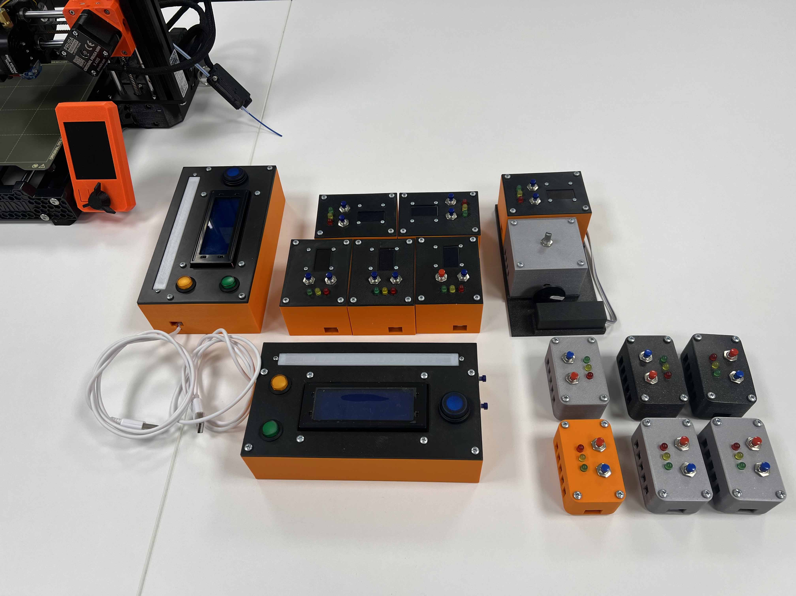

## Sensor Hub

This project is part of a full-stack application and is intended to gather various data such as temperature, humidity, air pressure, gas resistance, altitude, noise recordings, loudness levels and RPM values. The devices are placed at various locations in the Netherlands and are continuously sending these data to my website at: [sadra.nl](https://sadra.nl)

 

 

### Device Types

Sensor Hub is powered by ESP32 and there are 4 different device types:

- Sensor Unit
  - Designed for gathering climate data and loudness levels
- Sound Unit
  - Designed for recording loud noises and has a detachable microphone
- RPM Unit
  - Designed for gathering RPM values of rotating objects using laser and IR sensor
- HMI Unit
  - Designed as a user interface to manage other devices and communicate with the backend

### Features

- Two runtime modes: **normal** and a **configuration** mode that creates a new access point and HTTP server
  - You can connect to the WiFi created by the device and open the configuration page by navigating to the URL: [192.168.4.1](http://192.168.4.1)
  - Once you submit, the device will connect to the backend, fetch it's configuration, save it to the storage and reboot in normal mode
- Lots of focus on optimizations
  - **Debug** and **release** configurations apply different macros and compiler flags to make debugging easy and runtime faster
  - Enabling all **compiler warnings** to write safer code
  - Using **std::move** and **pass by reference** to avoid additional copies
- Supporting **multithreading** for all core functionality. Tasks are created, suspended and deleted when needed
  - This results to a boot time of only **100ms** when running in release mode
- Advanced **failsafe** system and logging mechanisms to notify users of potential errors and bugs
  - Saving a list of last **25** failures that occurred during the runtime
- Using **XOR** bitwise operations with the **mac address** to encrypt user data before saving to the storage
- Custom **Pin**, **WiFi**, **HTTP** and **Gui** classes to provide simple APIs for ease of use
- Handling runtime and backend errors and notifying users with a failsafe when errors occur

### Supported modules

- Climate
  - BME680
- Display
  - SSD1306
  - HD44780
- Microphone
  - INMP441
- LEDs
  - RGB LED Strip

---

Disclaimer: Please note that this project is currently under development. Various tests are conducted to make it bug-free, but there is always the possibility of errors.

Created with ♥ and maintained by Sadra Shameli. All Rights Reserved.
